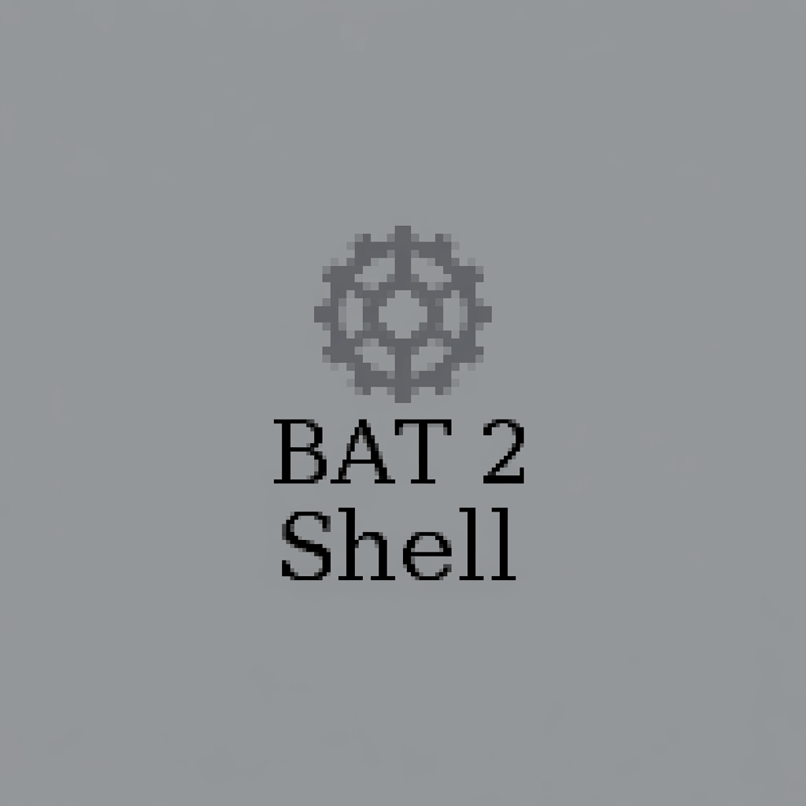

# bat2sh — Windows Batch to Shell Converter



**English** | [Русский](README_RU.md)

[](https://github.com/codzal/bat2sh/actions/workflows/ci.yml) [](https://github.com/codzal/bat2sh/security/code-scanning)  [](LICENSE) 

## Contents

[Quick start](#quick-start) · [Features](#features) ·
[CLI reference](#command-line-usage) · [GUI](#graphical-interface) ·
[Examples](#examples) · [How it works](#how-it-works) ·
[Limitations](#limitations) · [Security](SECURITY.md) ·
[Wiki](https://github.com/codzal/bat2sh/wiki)

`bat2sh` translates Windows batch (`.bat` / `.cmd`) scripts into POSIX
`bash` scripts. It is a best-effort, block-oriented translator that handles
the constructs most real-world batch files use, so the generated `.sh`
files can be run on Linux / macOS / WSL with little or no manual tweaking.

```
batch (Windows)  ──►  bash (Linux / macOS / WSL)
```

---

> **Status: beta (v0.4).** Many commands and edge cases are still being
> implemented — audit your scripts with `--analyze` / `-c` before relying
> on the output.

## Quick start

```bash
git clone https://github.com/codzal/bat2sh.git
cd bat2sh

# convert one file, print the bash script to stdout
python3 -m bat2sh examples/basics/01_hello_world.bat

# convert in place: myscript.bat -> myscript.sh
python3 -m bat2sh -i myscript.bat

# convert a whole folder (recursively) and syntax-check every result
python3 -m bat2sh -c path/to/batch/files/

# optional graphical interface
python3 frontend.py
```

Generated scripts need nothing but `bash`: run them with `bash name.sh`.

---

## Features (5 pillars)

1. **Faithful translation core** — variables (delayed expansion, substrings,
   case-insensitive replacement), full control flow incl. `for /r`, `for /f`
   with real cmd semantics, subroutines as bash functions, cmd.exe-style
   error messages and honest exit codes.
2. **Audit before you trust** — `--analyze` flags registry access, Windows
   binaries (wine/native hints) and service calls; `--report` writes an
   HTML/Markdown migration report with per-file coverage.
3. **Run it safely** — `-r` execute instantly, `--diff` side-by-side preview,
   `-c` + automatic shellcheck hints, `--strict-bash`, `--runtime-layer`,
   opt-in `-x`, custom command rules via TOML config.
4. **Two targets, any paths** — bash by default, PowerShell beta via
   `--target=ps1`; drive letters as WSL, Wine or root style
   (`--path-style`); Windows env vars mapped to XDG.
5. **Friendly tooling** — Tkinter GUI (dual-pane viewer with sync scroll &
   highlighting, target presets, RU/EN interface), VS Code task installer,
   snapshot tests + CI.

---

## Requirements

* Python 3.6+
* `bash` (for the generated scripts and the `-c` syntax check)
* `tkinter` (only for the frontend GUI)

---

## Command-line usage

```bash
# Convert a file (output to stdout)
python3 -m bat2sh script.bat

# Write next to the input as script.sh
python3 -m bat2sh -i script.bat
python3 -m bat2sh script.bat script.sh

# Read from stdin
cat script.bat | python3 -m bat2sh -

# Convert from stdin and run immediately (nothing is saved)
cat script.bat | python3 -m bat2sh

# Convert an entire folder of .bat/.cmd files at once
python3 -m bat2sh examples/

# Only syntax-check the converted output (writes nothing)
python3 -m bat2sh -c script.bat
python3 -m bat2sh -c examples/
```

| Option | Description |
| --- | --- |
| `-i`, `--inplace` | Write `<input>.sh` beside the input file |
| `-o`, `--output-dir DIR` | Write outputs into `DIR` (mirrors the folder tree for directories; places `<name>.sh` there for a single file) |
| `-c`, `--check` | Only run `bash -n` on the result; no files written |
| `-C`, `--no-clobber` | Don't overwrite existing output files |
| `-r`, `--run` | Convert and execute immediately (nothing written) |
| `--path-style {wsl,wine,root}` | Drive-letter mapping style |
| `--shebang STR` | Interpreter line for generated scripts |
| `-x`, `--executable` | chmod 0700 the written .sh files (owner only) |
| `--diff` | Show batch vs bash side by side |
| `--strict-bash` | Insert `set -euo pipefail` |
| `-d`, `--debug` | Keep converter debug comments (output is clean by default) |
| `--analyze` / `--report FILE` | Compatibility audit / migration report |
| `--runtime-layer` | Inject errorlevel + drive-symlink helpers |
| `--target {bash,ps1}` | Output language (ps1 is beta) |
| `-q`, `--quiet` | Suppress informational messages (errors are still shown) |
| `--encoding ENC` | Force input decoding with this codec (e.g. `cp1251`, `latin-1`); default is auto-detect |
| `--version` | Print the version and exit |
| `-h`, `--help` | Show help |

When the input is a **directory**, every `.bat`/`.cmd` file found inside it
(recursively) is converted to a `.sh` file placed next to it.

---

## Graphical interface

A Tkinter GUI is provided for users who prefer point-and-click operation:

```bash
python3 frontend.py
```

It offers file/folder selection (with drag & drop when `tkinterdnd2` is
installed), output options (next-to-input, choose file, output directory,
or preview-only), a *syntax-check only* mode, target language and path
presets, run-after-convert, audit mode, runtime layer, shebang override
and quiet mode. Less obvious controls explain themselves on hover.
A live dual-pane preview with synchronized scrolling, copy-to-clipboard,
*Save As…* and an encoding selector are included. A menu bar
(File / Edit / Run / Help) and keyboard shortcuts (`Ctrl+O`, `Ctrl+S`,
`Ctrl+C`, `F5`) are provided.
The UI language can be switched in the **Language** menu - English is
built in, further languages ship as editable `languages/<code>.txt`
packs (e.g. `languages/ru.txt`).

> ⚠️ Non-English UI packs are community translations and may be incomplete.
> English is the reference language. The **wiki** is maintained in English only.

---

## Examples

The [`examples/`](examples/) directory contains categorized, self-contained
batch files that demonstrate (and verify) the converter's coverage:

```
examples/
  basics/           variables, echo, arguments, substrings
  control_flow/     if/else, loops, goto & subroutines
  file_operations/  md/copy/move/ren/del/rd with spaces & redirects
  advanced/         build scripts, user interaction, Windows path translation
  complextasks/     40 stress cases: log rotation, CSV reports, recursion,
                    state machines, retry loops and more
  */ps/             hand-written PowerShell counterparts of each category
```

Every example round-trips through CI twice: converted output must pass
`bash -n`, and `--target=ps1` output must parse under pwsh.

Run `examples/generate_examples.sh` to convert the whole tree in one command:

```bash
bash examples/generate_examples.sh
```

---

## How it works

The converter parses the batch file into a list of statements and emits a
single `bash` script driven by a **program-counter dispatch loop**:

```bash
PC=0
dispatch() {
    case $PC in
        0)  ... ; PC=1 ;;
        1)  ... ; PC=2 ;;
        ...
    esac
}
while [ "$PC" -ge 0 ]; do dispatch; done
```

This faithfully models `goto`, including jumps that leave `for`/`if` blocks
(the `goto` simply sets `PC` and `return`s), and `call :label` subroutines
(with their own argument/`return` stack).

---

## Limitations

bat2sh is a translator, not an emulator. Known caveats:

* `errorlevel` reflects the status of the **last executed command**, exactly
  as in batch (this matches real `cmd.exe`).
* `start` strips switches/title and backgrounds the process (`nohup ... &`);
  POSIX has no console/session concept.
* `color` sets ANSI text color only; `mode`, `chcp` and a few console-only
  commands are no-ops.
* The command source of `for /f '...'` executes as a shell command;
  batch-only syntax inside is not re-parsed.
* Computed variable names (`!prefix_%%i!`) translate to `Set-Variable` /
  bash indirect expansion, but exotic nesting may still fall back to a
  warning comment.
* `--target=ps1` produces parse-clean PowerShell 7 for every bundled
  example, yet remains beta: command coverage is smaller than the bash
  target and semantics are best-effort.
* GUI translations other than English may be incomplete.

Patches and example batch files that expose missing behaviour are welcome.

---

## License

Released under the [MIT License](LICENSE).
